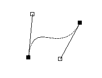

# Bezier Curve
A Bezier Curve demo using C++ and SDL



## Depedencies
requires SDL  
Ubuntu install:  
`sudo apt-get install libsdl2-2.0-0`

## Building

To build:
```bash
mkdir build
cd build
cmake ..
make
```

To Run:  
```
./BezierCurveDemo
```

